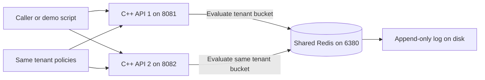
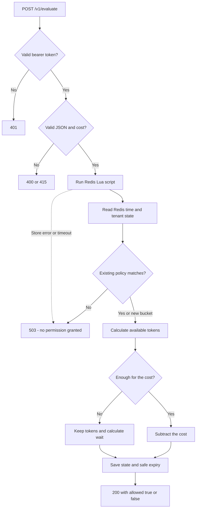

# How the rate limiter works

Read this after running `make demo`. Each section explains a decision using the same example: **a tenant with capacity 10 and refill rate 2 tokens per second**.

## 1. Two API instances, one shared allowance

An instance is one running copy of our C++ program. The demo runs two copies on different ports. A request can reach either one.



The demo explicitly alternates between the API ports. There is no load balancer in this project. Both API processes can receive traffic and ask Redis for a decision.

If each process kept its own ten-token counter, Tenant A could spend ten through API 1 and another ten through API 2. Using one shared bucket prevents that accidental doubling.

Tenant A's Redis key looks like `rl-demo:{tenant-a}:bucket`. Tenant B has a different key. Both API instances must use the same Redis host, port, and key prefix for the same tenant.

## 2. What a token bucket promises

Imagine a container holding at most ten permission tokens. Each accepted one-unit operation removes one token. Two tokens replenish every second, up to the maximum of ten.

| Situation | Result |
|---|---|
| Bucket is full; ten requests arrive together | All ten can be allowed |
| An eleventh arrives immediately | Denied if no whole token has replenished |
| Half a second passes after exhaustion | One token is available |
| One minute passes with no activity | Ten tokens are available, not 120 |

**Capacity controls the immediate burst; refill rate controls the sustained allowance.**

This is different from “at most ten requests in every rolling five-second interval.” For example, ten can be spent immediately and more can be spent as refill happens within those five seconds. If the requirement is a strict rolling-window count, select an algorithm that implements that contract.

| Alternative | How it works | Tradeoff |
|---|---|---|
| Fixed window | Count requests in a fixed minute | Ten just before the boundary and ten just after can pass close together |
| Sliding-window log | Keep timestamps and count requests in the latest interval | Exact rolling count, but more records to store and process |
| Token bucket, used here | Store available tokens and last update time | Small state per tenant; permits explicitly configured bursts |

## 3. How refill is calculated

There is no background task adding tokens every half second. Refill is calculated when a request arrives.

Suppose the last stored state is two tokens at 12:00:00. A request arrives at 12:00:03:

```text
Elapsed time:       3 seconds
Newly replenished:  3 × 2 = 6 tokens
Available:          min(10, 2 + 6) = 8 tokens
Request costs:      1 token
Remaining:          7 tokens
```

The service stores seven tokens and the new timestamp. Its next calculation starts from there. The `min` prevents a long idle period from building more than ten tokens.

Fractions are preserved. After 0.2 seconds, an empty bucket has 0.4 tokens. That is not enough for a one-token request, but the fraction must not be discarded. The API rounds available tokens down for the `remaining` field; Redis retains the fractional value.

## 4. Why the entire decision must be atomic

Atomic here means another client's Redis command cannot run between our script's read and its final update.

Without it, two API instances can do this:

| Step | API 1 | API 2 |
|---|---|---|
| Read | Sees one token | Sees the same one token |
| Decide | Allows a request | Allows another request |
| Write | Stores zero | Stores zero |

Two requests passed using one token. Even if each Redis command is individually atomic, the sequence of separate commands is unsafe.

Our Lua script performs **read → refill → check → subtract if allowed → save** as a single execution. With one available token and no intervening refill, one request consumes it; the next sees zero and is denied. Redis provides this execution guarantee for scripts. [Redis scripting documentation](https://redis.io/docs/latest/develop/programmability/eval-intro/)

A C++ mutex cannot solve coordination between these separate processes. It would protect threads inside one API only.

Also distinguish atomic execution from database-style rollback: Redis does not automatically undo earlier script writes after every possible script error. We validate policy and state before writing and keep the script short.

## 5. Follow a request through the service



The server identifies the tenant from the bearer token and supplies that tenant's configured capacity/rate to Redis. A caller cannot choose its own higher limit. Unknown body fields are rejected.

A request with cost three either consumes three tokens or consumes none. It never partially consumes two and asks the caller to retry for the rest.

## 6. A rejected request can still update state

Rejection means **no tokens were spent**. It does not mean no time has passed.

```text
Previously stored:   0 tokens
Elapsed time:        0.2 seconds
Refill rate:         2 tokens/second
Available now:       0.4 tokens
Request cost:        1 token → denied
```

The script can save 0.4 tokens and the refreshed timestamp. It records refill, not a charge. If another 0.3 seconds passes, 0.6 more tokens replenish and the total reaches one.

A denial also updates the safe expiry described below. Repeating denied requests should not reset the bucket to empty or move its full-refill deadline farther away simply because requests keep arriving, assuming the clock progresses normally.

## 7. Why expiry must wait until the bucket would be full

Redis expiry automatically removes an entry after a specified duration. That duration is its **TTL**, or time to live. Removing idle entries saves memory.

Our service treats a missing entry as a full bucket. Therefore, deleting state is safe only once that assumption matches what refill would have produced.

Example: capacity ten, two tokens remaining, refill two per second. Time to full is `(10 − 2) / 2 = 4 seconds`.

| When entry is removed | Tokens if retained | Tokens when recreated | Correct? |
|---|---:|---:|---|
| After one second | 4 | 10 | No: six extra tokens appear |
| After four seconds | 10 | 10 | Yes: the states are equivalent |

Expiry is calculated from remaining tokens after the decision. If a later accepted request spends more tokens, it can move the full-refill deadline later.

Quota inspection only computes a snapshot. It does not consume, save, or extend TTL. Watching a bucket does not keep an idle entry alive forever, and inspecting a missing bucket does not create it.

## 8. Why clock changes need special handling

All API instances ask Redis for time. That avoids calculating refill using two API machines whose clocks differ.

Redis time is still wall-clock time and can move backward. Suppose the last update says 12:00:10, but the current clock says 12:00:08.

We use:

```text
effective_now = max(current_time, last_update_time)
```

This keeps effective time at 12:00:10. No refill occurs while the clock catches up, and the timestamp never moves backward. Otherwise, moving the timestamp backward could let the same interval refill again later.

Expiry must include this delay. If the bucket needs four more seconds of refill:

```text
Clock catch-up delay:   2 seconds
Refill time needed:     4 seconds
Safe expiry delay:      6 seconds
```

The retry estimate also includes catch-up delay when there are insufficient tokens. These calculations handle the backward jump observed during that request. They are not a guarantee against all future clock changes: a forward jump can refill or expire state early. A stricter system needs a stronger time contract.

## 9. Why every API must use the same policy

A policy consists of capacity and refill rate. Existing Redis state stores those values alongside the token count.

Suppose API 1 is configured for capacity ten, rate two. API 2 mistakenly uses capacity twenty, rate five. If API 1 created the entry, API 2 sees a mismatch and returns 503 instead of changing the rules midway through the bucket's life.

That check is useful, but only while the state exists:

```text
The entry expires, including its stored policy.
API 2 receives the next request.
There is nothing left to compare against.
API 2 creates a full twenty-token bucket using its own configuration.
```

**The check detects some configuration mistakes; it is not a central policy service.** All replicas must start with identical policies. Files are loaded at startup; changing a file does not hot-reload a running process.

They must also share the namespace (`KEY_PREFIX`). If one uses `rl-demo` and another uses `rl-other`, they create different keys and grant independent allowances without a mismatch error.

For live policy changes, a future design should store shared, versioned policy separately from expiring bucket state. It must define transitions too: if capacity drops from ten to five while eight tokens remain, should available tokens immediately be capped at five? That behavior needs an explicit decision.

## 10. Threads, Redis connections, and resource ownership

Each API has eight worker threads handling HTTP connections. Each worker owns its own hiredis connection, created when needed and reused afterward. Hiredis's `redisContext` is not safe for simultaneous access by multiple threads. [Hiredis documentation](https://github.com/redis/hiredis/blob/v1.2.0/README.md)

The C++ wrapper uses RAII: ownership objects automatically free Redis connections and reply objects when they go out of scope, including when an exception occurs. This is why error paths do not need to remember a manual free at every return.

Redis connect and I/O timeouts are one second each. HTTP read/write timeouts are two seconds. These are operation timeouts, not a guaranteed one-second end-to-end deadline.

The HTTP queue holds up to 128 pending connections. Once full, extra connections may close without a JSON error. This bounds queued work; it does not guarantee fair service between tenants or polished overload responses.

The binary embeds the Lua script and sends it using `EVAL` each time. A future optimization is `EVALSHA`: send an identifier for a script already cached by Redis, and reload if Redis reports `NOSCRIPT`. That would reduce repeated script transfer.

## 11. What happens when Redis is unavailable

This service chooses **fail closed**: if it cannot obtain a quota decision, it returns 503 and grants no permission.

Fail open would allow requests when Redis is down. That improves availability but can violate the quota. Neither is universally correct; the product's requirements decide. Our caller is expected to honor the fail-closed contract.

The API may still answer `/healthz` because its own process is alive. `/readyz` fails because Redis cannot be reached. A later request can establish a new connection after Redis recovers; the current failed consumption request is not automatically replayed.

## 12. A timeout does not prove nothing happened

Consider this sequence:

```text
API asks Redis to consume one token.
Redis consumes it.
The reply is lost or delayed.
API times out and returns 503.
```

The API cannot know whether the token was consumed. Automatically repeating the command could consume a second token for one logical operation, so our client does not retry it automatically.

The caller can still choose to retry, but may be charged again. Our generated `request_id` is only an identifier; it does not prevent duplicate consumption.

A future idempotency design would accept a stable operation ID and atomically store both the decision and token update. Retrying the same operation would retrieve the old decision. That also requires tenant scoping, request-body matching, and a defined retention period; it is not implemented here.

## 13. What survives a restart

| Restart/failure | Expected behavior |
|---|---|
| API process restarts, Redis stays up | Shared quota stays in Redis; local metrics reset |
| Idle bucket expires normally | Next request starts full, matching expected refill |
| Redis loses quota data | Missing bucket becomes full, potentially allowing extra work |
| Redis fails over to a replica missing recent writes | Recent consumption may be lost |

Demo Redis uses an **append-only file (AOF)**: a log of writes that can be replayed after restart. Its `everysec` setting normally syncs about once per second, so recent changes can still be lost during a crash. This is not a zero-loss guarantee.

Redis replication can also lose acknowledged writes during failover. Atomic Lua prevents requests from interleaving at a live primary; it does not guarantee every accepted change survives every failure. [Redis replication documentation](https://redis.io/docs/latest/operate/oss_and_stack/management/replication/)

Redis memory eviction is another concern. Evicting a depleted bucket makes it look new and full. A production quota store should use a no-eviction policy and monitor memory: failing a decision is safer for a strict limit than silently forgetting consumption.

## 14. What scales, and what eventually becomes the bottleneck

Adding API instances increases the capacity to receive and process HTTP requests, but every decision still reaches the same Redis primary.

For example, adding ten API instances will not help if Redis is already spending all its time executing scripts. One very busy tenant can also generate a large share of that work.

A future system could distribute different tenants across different Redis servers. The braces in `{tenant-a}` are a Redis Cluster hash-tag convention that can help keep related tenant keys together, but this project does not implement Cluster discovery or redirection. It also has no Sentinel failover discovery or cross-region design.

Measure throughput, tail latency, Redis CPU, queue pressure, and connection counts before choosing a scaling change. The tests prove specific correctness properties; they are not a production load benchmark.

## 15. Production improvements, tied to concrete risks

| Current limitation | Why it matters | Next improvement |
|---|---|---|
| Local HTTP and Redis connections have no TLS | A remote network could expose credentials and traffic | Add TLS and appropriate network access controls |
| Static bearer-token mapping | Token rotation and centralized identity are limited | Integrate identity management and rotation |
| Any valid tenant can read aggregate metrics | Tenants can see overall traffic counters | Separate operator authorization |
| One Redis primary | Store outage blocks decisions | Design availability and durability around an agreed failure contract |
| No duplicate-request detection | Lost replies can cause repeated charging | Add atomic idempotency records |
| Configuration exists separately in each API | Mixed policies can grant inconsistent quota | Centralize/version policy and define update transitions |
| Floating-point token arithmetic | Tiny rounding differences are possible | Use suitable fixed-point/integer arithmetic if stricter accounting is required |
| Wall-clock time can jump forward | Refill may happen earlier than intended | Define stronger time guarantees if required |
| Linear lookup over at most 1000 tenant tokens | Authentication work grows with configured tenants | Use a scalable, vetted authentication design |
| Queue overflow may close connections | Clients may get connection errors rather than clear overload responses | Add deliberate overload handling and load tests |

The token comparison avoids returning at the first mismatching byte for equal-length strings, but the full authentication path is not a vetted constant-time security implementation. Treat it as a local exercise mechanism.
