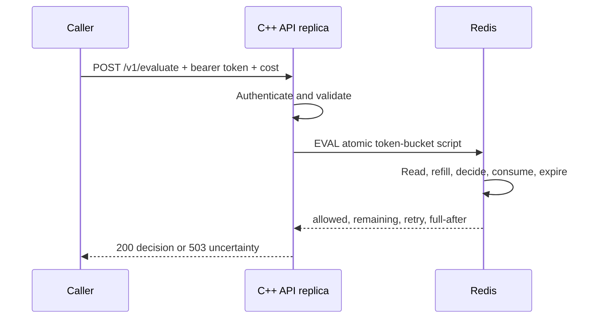

# Code walkthrough

This guide explains the project from process startup to one completed quota decision. Read the
files in the order shown here rather than alphabetically.

## 1. Start with the system boundary

The service does not proxy a business request. It answers one question:

```text
May this authenticated tenant spend this many tokens now?
```

The caller sends `POST /v1/evaluate`. A successful calculation returns HTTP 200 with either
`allowed: true` or `allowed: false`. A gateway or application must translate `allowed: false`
into HTTP 429 for its protected request. If the limiter cannot calculate a trustworthy decision,
it returns 503 and grants no permission.



## 2. Understand what the build produces

Open the `Makefile` first.

1. `make` builds `vendor/hiredis/libhiredis.a`.
2. `scripts/embed.py` reads `src/bucket.lua`.
3. It generates `build/bucket_script.hpp` containing the Lua source as a C++ string.
4. The compiler builds `src/main.cpp` and links the vendored hiredis library.

The final executable contains the Lua script. It does not need `src/bucket.lua` at runtime.
Whenever the Lua file changes, `make` regenerates the header before rebuilding.

Why embed it? Deployment has one executable instead of an executable plus a script whose version
might not match. The tradeoff is that this implementation sends the full script through `EVAL`
on each decision. A production optimization would use `EVALSHA` and reload on `NOSCRIPT`.

## 3. Follow local startup

`make run` executes `scripts/start-local.py`.

The supervisor:

1. Creates `.local/tenants.json` with two random bearer tokens if it does not exist.
2. Verifies that Redis port 6380 and API ports 8081/8082 are available.
3. Starts one loopback-only Redis process with append-only persistence.
4. Starts two copies of `build/rate-limiter`.
5. Gives both APIs the same Redis address, tenant file, and key prefix.
6. Gives each API a distinct HTTP port and instance ID.
7. Waits for both `/readyz` endpoints before printing `Ready`.
8. Terminates all child processes when interrupted.

The two APIs are separate operating-system processes. Their local memory is independent. They
enforce one allowance only because both send the same tenant key to the same Redis data store.

## 4. Read `main.cpp` in five sections

### 4.1 Configuration and policy loading

`read_env` and `read_port` load environment configuration and reject invalid ports.

`Policy` holds:

```text
id                 Redis-key identity and response identity
token              Demo bearer credential
capacity           Maximum tokens and burst size
rate               Tokens replenished per second
rate_text           Exact JSON representation sent to Redis
```

`load_policies` parses the tenant JSON once during startup. It validates shape, types, bounds,
identifiers, token length, and duplicate IDs/tokens. Loading once keeps the request path simple,
but it means policy changes require restarting every replica. All replicas must receive identical
files.

`tokens_match` avoids returning at the first mismatching byte for equal-length tokens. This is a
demo defense, not a production identity system. A real gateway should validate a signed identity
or API key and pass a trusted subject to the limiter.

### 4.2 Redis ownership and signals

Inside `main`, the `store` lambda returns a `thread_local RedisStore`.

`cpp-httplib` uses worker threads, while a hiredis `redisContext` cannot be shared concurrently.
Giving each worker its own context avoids races and avoids serializing all workers behind a C++
mutex. Redis still serializes each Lua state transition for a given primary.

SIGINT and SIGTERM are blocked before workers start. A dedicated thread waits with `sigwait` and
calls `server.stop()`. This avoids invoking non-signal-safe server operations from an asynchronous
signal handler.

### 4.3 Server limits and health

The server uses eight workers and a queue of 128 tasks. Request bodies are limited to 4096 bytes,
socket waits are bounded, and keep-alive reuse is limited. These bounds stop one process from
accumulating unlimited queued work; they are not proof of production throughput.

The health endpoints intentionally answer different questions:

| Endpoint | Meaning |
|---|---|
| `/healthz` | The API process can answer HTTP. |
| `/readyz` | This worker can also PING Redis. |

During a Redis outage, liveness remains 200 while readiness becomes 503. An orchestrator can keep
the process alive but remove it from service until its dependency recovers.

### 4.4 Authentication and request validation

`authenticate` reads `Authorization: Bearer ...` and returns the matching server-side `Policy`.
The request never supplies a trusted tenant ID. A body such as `{"tenant_id":"other"}` is
rejected instead of allowing tenant spoofing.

`make_quota_handler` builds both quota endpoints:

| Mode | Endpoint | Mutation |
|---|---|---|
| Consume | `POST /v1/evaluate` | Spends the requested cost when allowed. |
| Inspect | `GET /v1/quota` | Calculates a snapshot without writing or extending TTL. |

Evaluation accepts `{}` for cost one or `{"cost": n}` for a positive integer no greater than
capacity. Unknown fields, query parameters, malformed JSON, wrong content type, booleans,
fractions, and out-of-range costs are rejected before Redis is called.

### 4.5 Decision and response

The handler constructs this key:

```text
<prefix>:{<tenant-id>}:bucket
```

For example:

```text
rl-demo:{tenant-a}:bucket
```

The braces are a Redis Cluster hash tag. This implementation uses standalone Redis, but a future
cluster will hash only `tenant-a`, allowing related tenant keys to occupy the same slot.

The API sends the embedded script, one key, capacity, refill rate, cost, and mode to
`RedisStore::evaluate`. It converts the positional Redis result into named JSON fields and updates
process-local metrics.

Expected client errors preserve their 4xx status. Any Redis, state, or policy exception becomes
503. This is fail-closed behavior: uncertainty never becomes permission.

## 5. Follow `RedisStore`

`src/redis_store.hpp` is a small ownership and protocol boundary.

### Resource ownership

`ContextDelete` and `ReplyDelete` let `std::unique_ptr` release hiredis contexts and replies on
normal and exceptional paths. This is RAII: ownership is tied to object lifetime rather than a
manual cleanup call at every return.

### Connection lifecycle

`connect` reuses a healthy connection. Otherwise it opens one with a one-second timeout, applies
the command timeout, and optionally authenticates. Failure clears the context and throws.

`command` uses `redisCommandArgv`, passing every argument with its exact byte length. If no reply
arrives, it clears the connection and reports an unknown outcome. It deliberately does not retry
a consumption: Redis may have applied it before the reply was lost.

### Reply validation

`evaluate` expects exactly four Redis integers:

```text
allowed, remaining, retry_after_ms, full_after_ms
```

Anything else is treated as inconsistent store behavior and fails closed.

The current class connects to one host. It is not Redis Cluster-aware: it cannot route by hash
slot or handle `MOVED`, `ASK`, resharding, and promoted-primary discovery. The Lua algorithm is
cluster-compatible because it currently touches one hash-tagged key, but the client must be
replaced for a clustered deployment.

## 6. Execute `bucket.lua` by hand

Redis runs the script atomically: another Redis command cannot interleave between its read and
write. That atomic boundary is the core distributed-concurrency mechanism.

Inputs are:

```text
KEYS[1]  tenant bucket key
ARGV[1]  capacity
ARGV[2]  refill tokens per second
ARGV[3]  request cost
ARGV[4]  consume or inspect
```

### Step A: validate before mutation

The script converts numeric arguments and validates capacity, rate, cost, and mode before any
write. Keeping possible errors before mutation matters because Redis script errors do not imply a
general database rollback.

### Step B: get one clock source

`TIME` comes from Redis, so all API replicas use the same source for refill calculations. Time is
converted to milliseconds.

### Step C: read state

The hash stores:

```text
tokens       fractional available balance
updated_ms   effective time of the previous update
capacity     policy used to create the state
rate         refill policy used to create the state
```

Missing state means a full bucket. Existing state must contain the same capacity and rate supplied
by the API; otherwise the script rejects a mixed-policy decision.

### Step D: calculate refill

The formula is:

$$
\text{tokens} = \min\left(\text{capacity},\ \text{tokens} +
\frac{(\text{effectiveNow}-\text{updated})\times\text{rate}}{1000}\right)
$$

where:

$$
\text{effectiveNow}=\max(\text{RedisNow},\text{updated})
$$

The maximum prevents a backward wall-clock jump from granting the same refill interval twice.
Fractional tokens are preserved in Redis even though the HTTP response reports only whole
remaining tokens.

### Step E: decide and consume

The request is allowed when `tokens >= cost`. A consume operation subtracts the full cost only
when allowed. A denial spends nothing, but it may still save newly calculated refill progress.
Inspection neither subtracts nor writes.

### Step F: calculate delays and expiry

For a denied request:

$$
\text{retryMs}=\left\lceil\frac{(\text{cost}-\text{tokens})\times1000}{\text{rate}}
+\text{clockCatchup}\right\rceil
$$

The state expires only after the bucket would naturally become full. This is essential because a
missing bucket is interpreted as full. Deleting depleted state earlier would grant free tokens.

### Worked example

Assume capacity 10, rate 2 tokens/second, two stored tokens, and three elapsed seconds:

```text
Refill:       3 × 2 = 6
Available:    min(10, 2 + 6) = 8
Cost:         3
Allowed:      true
Stored:       5
Time to full: (10 - 5) / 2 = 2.5 seconds
```

Two API processes racing this operation cannot both read the same old balance because the entire
script executes before the next script begins.

## 7. Understand the failure cases

### Redis is unreachable before execution

The API returns 503 and grants no decision. Readiness also returns 503. A later request attempts
to reconnect.

### Redis executes but the reply is lost

The API still returns 503 because it cannot know the result. It does not automatically retry,
because retrying could spend twice. A production idempotency design would atomically store a
client operation ID and its previous decision alongside consumption.

### API process restarts

Quota remains because Redis owns it. Process-local metrics reset.

### Redis loses data or fails over behind replication

Missing state appears full and may over-admit. Atomic scripting prevents live-primary races but
does not guarantee persistence or synchronous replication. Redis Cluster improves sharding and
failover automation, not perfect durability.

### Replicas use different policies

Existing state detects a capacity/rate mismatch and returns 503. After that state expires, there
is nothing left to compare, so a misconfigured replica could create a different bucket. Production
rules need centralized, versioned distribution.

## 8. Read the tests as executable requirements

Run:

```sh
make test
```

`tests/integration.py` starts disposable Redis and two real API processes.

The first group replaces only the script's Redis-time expression with controlled time. It proves
refill, capacity capping, retry delay, backward-clock handling, safe expiry, and non-mutating
inspection.

The HTTP group validates authentication and malformed costs. It then sends 80 concurrent requests
across both API processes. Capacity is 10 and refill is deliberately one token per 1000 seconds,
so exactly 10 decisions must be allowed before refill can affect the assertion.

Later checks prove:

- Tenant B does not share Tenant A's bucket.
- Restarting an API does not reset quota.
- A conflicting policy fails closed.
- Stopping Redis leaves liveness healthy but makes readiness and evaluation return 503.
- The client reconnects after Redis restarts.

These tests establish important correctness properties. They are not a load test and do not prove
the reference targets of less than 10 ms or one million requests per second.

## 9. Map local execution to containers and CI

The multi-stage `Dockerfile` compiles in one Debian image and copies only the executable into a
smaller runtime image. The runtime uses a non-root user. Compose further drops capabilities,
enables a read-only API filesystem, mounts tenant configuration read-only, and starts two API
containers sharing one persistent Redis container.

`.github/workflows/ci.yml` performs three checks on Ubuntu:

1. Build the native executable.
2. Run the deterministic and two-process integration suite.
3. Build and start the Compose stack, then run a cross-container shared-quota smoke test.

CI verifies repeatability; it does not deploy the service or create a highly available Redis
topology.

## 10. Use this reading order during an interview

1. Draw `client -> API replicas -> shared Redis`.
2. Open `main.cpp` at `make_quota_handler` to show identity, validation, and the Redis call.
3. Open `bucket.lua` and explain the atomic read-refill-check-consume-write boundary.
4. Open `redis_store.hpp` to explain connection ownership and unknown outcomes.
5. Open the 80-request test to prove contention across processes.
6. Finish with the documented gaps: one Redis primary, static policy, demo identity, no
   idempotency, and no performance benchmark.

Do not begin with every startup helper or C++ detail. Establish the distributed correctness
problem first, then show the code that solves it.

## 11. Hands-on exercises

Complete these in order to make the implementation familiar:

1. Run `make run` and call `/healthz` on both ports. Confirm distinct instance IDs.
2. Run `make demo` and observe one allowance being spent through alternating API processes.
3. Inspect quota twice and verify inspection itself does not reduce `remaining`.
4. Stop Redis while the APIs remain alive. Compare `/healthz`, `/readyz`, and `/v1/evaluate`.
5. Read one deterministic test case and calculate its expected four-element Lua result manually.
6. Change only the demo capacity in both tenant policies, restart the stack, and predict the demo.
7. Explain why moving the Redis read outside Lua would allow two requests to spend one token.
8. Explain why adding API replicas improves HTTP capacity but not single-primary Redis capacity.

After these exercises, you should be able to explain every production claim in terms of either a
specific code path, a test, or an explicitly documented limitation.
